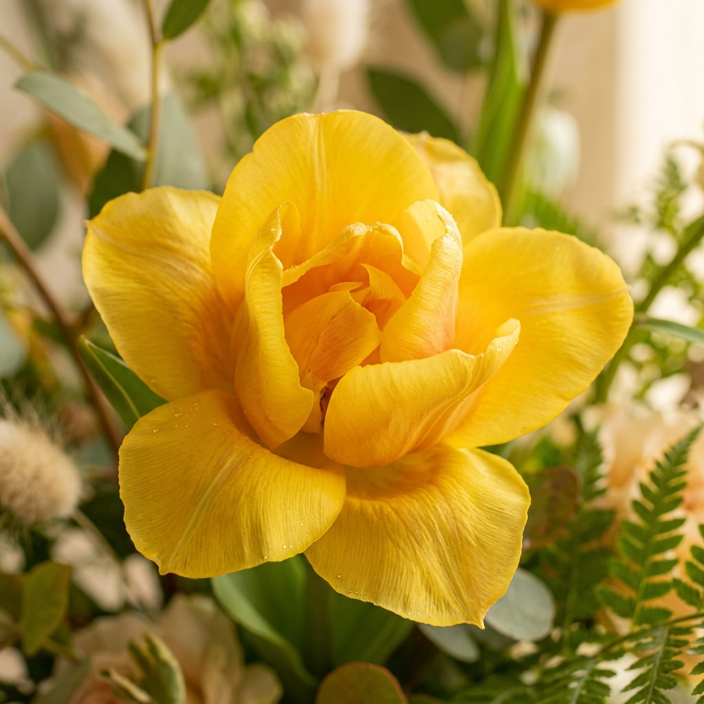

# Flores Amarillas 🌼 — Experiencia Digital (21 de Septiembre)

Una landing page temática, romántica, viva e interactiva creada para celebrar la tradición contemporánea de **regalar flores amarillas cada 21 de septiembre** como símbolo de cariño, ilusión, amistad, amor, esperanza y luz.



---

## 🌟 Concepto Creativo

> *"Un jardín digital que florece mientras recorres la página."*

A diferencia de una floristería convencional o plantilla corporativa, esta experiencia está diseñada desde el primer segundo para sentirse como un **detalle digital único e inolvidable** preparado para alguien especial.

---

## 🎨 Características & Dirección Artística

- **Paleta Cromática Botánica**: Amarillo floral vivo (`#FFD84D`), Amarillo intenso (`#F6C900`), Crema cálido (`#FFF9EA`), Verde natural (`#526B3F`) y Carbón cálido (`#222018`).
- **Tipografía Editorial**: `Playfair Display` + `Cormorant Garamond` combinadas con la tipografía de UI `Plus Jakarta Sans`.
- **Efecto de Brisa de Pétalos**: Animación interactiva en `HTML5 Canvas` con física de viento y partículas de pétalos dorados flotantes.
- **Narrativa Continua**: 
  1. **01 · Hero**: Impacto visual asimétrico con titulares entrelazados y llamado a la acción.
  2. **02 · Significado**: Nube interactiva de palabras (Alegría, Cariño, Amistad, Esperanza, Amor, etc.).
  3. **03 · Mensaje Emocional**: Pausa poética con espacio negativo.
  4. **04 · Jardín Interactivo**: Colección de especies (Girasoles, Tulipanes, Rosas, Ramilletes silvestres).
  5. **05 · Carta Personalizable**: Tarjeta con editor modal en tiempo real para cambiar el destinatario, mensaje y remitente, generando enlaces listos para regalar.
  6. **06 · Quote Editorial**: Frase monumental tipográfica.
  7. **07 · Ramillete Final**: Culminación con lluvia de pétalos y opciones para copiar enlace o regalar.
  8. **08 · Footer Minimalista**: Detalle de cierre (*21 · 09*).
- **Música de Entorno Sintetizada**: Sintetizador ambiental cálido integrado mediante Web Audio API (opcional con botón de activación).

---

## 🚀 Cómo Ejecutar Localmente

No se requieren dependencias externas complejas.

```bash
# Clonar el repositorio
git clone https://github.com/VictorCD20/flores_amarrillas.git

# Entrar al directorio
cd flores_amarrillas

# Abrir directamente en tu navegador o mediante un servidor local:
python -m http.server 8000
```

Luego abre en tu navegador: `http://localhost:8000`

---

## 📁 Estructura del Proyecto

```text
├── index.html        # Estructura semántica HTML5 de la experiencia
├── styles.css        # Sistema de diseño CSS3, tokens, layout y animaciones
├── script.js        # Lógica de animaciones canvas, interactividad y modal
└── assets/           # Fotografías botánicas de alta resolución
    ├── hero_flower.jpg
    ├── sunflower.jpg
    ├── tulip.jpg
    └── bouquet.jpg
```

---

## 💛 Créditos y Dedicatoria

Hecho con cariño y muchas flores amarillas para el **21 de septiembre**.
